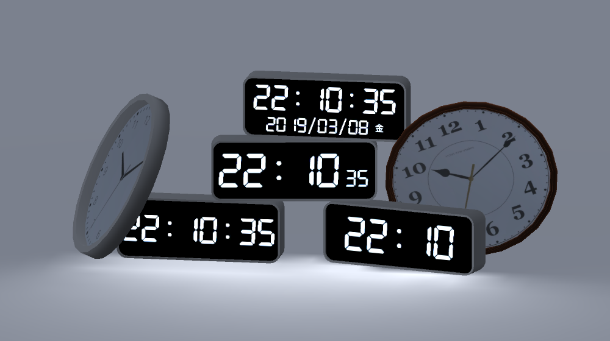

# vrchat-time-shaders

Utility shaders to implement time-related stuffs in VRChat.

## Demo
The demo world is available [here](https://www.vrchat.net/home/launch?worldId=wrld_3efd0dcc-1bae-44b2-bba3-996038aa11b0)!

## How to Use
1. Import the latest VRChat SDK to your Unity scene.
2. Import this package
3. Place `vrchat-time-shaders/Prefabs/VTS_Panorama` in the scene.
  * You may want to change its layer so that it will be invisible for others.
  * You can change the timezone by adding `?timezone=[hour]` to the Panorama's URL. The default is `timezone=9` (JST).
4. Place the clock Prefab(s) in `vrchat-time-shaders/Prefabs/Models`.
  * You don't have to place multiple `VTS_Panorama`, even if you place multiple clock Prefabs.
  * You can check its behavior by "Play" the scene.
    * Since this package relies on the [`_Time` builtin variable](https://docs.unity3d.com/Manual/SL-UnityShaderVariables.html), time shown in Unity might be inaccurate.

## Table of Contents
- assets: Textures and shaders used in the package
- cgi: The Panorama API
  - Currently the API is provided on [y23586.net](https://y23586.net), but you can host your own backend on your server by using this script.
- unity-packages: The Unity package for VRChat world projects
- docs: The WebPanel API

---

時間に関係するちょっとしたオブジェクトをVRChatに追加するパッケージです。

## デモ
[このワールド](https://www.vrchat.net/home/launch?worldId=wrld_3efd0dcc-1bae-44b2-bba3-996038aa11b0)で動作を確認できます。

## 使い方
1. 最新のVRChat SDKを導入する。
2. このパッケージを導入する。
3. `vrchat-time-shaders/Prefabs/VTS_Panorama`をどこでもいいのでシーンに配置する。
  * 見えるのが気になる場合はRefernce CameraのCulling Maskから適当に除外してください。
4. `vrchat-time-shaders/Prefabs/Models`内のお好みの時計を配置する。
  * 時計の数にかかわらず`VTS_Panorama`は1個だけ配置すれば動作します。
  * Unityの"Play"ボタンを押すと簡易的な動作確認ができます。
    * Play後に`VTS_Panorama`に何らかの画像がロードされれば正常に動作しています。
    * このパッケージは[`_Time`変数](https://docs.unity3d.com/ja/current/Manual/SL-UnityShaderVariables.html)を使用しているため、仕様上Unity上では時刻にズレが生じます。この場合でもVRChat内では正常に表示されるはずです。

詳細は[Wiki](https://github.com/y23586/vrchat-time-shaders/wiki)をご参照ください。

## 内容物
- assets: パッケージ内で使用されているテクスチャ・シェーダ
- cgi: パノラマ用画像生成スクリプト
  - 現在は[y23586.net](https://y23586.net)でAPIを提供しているためサーバを用意する必要はありませんが、このスクリプトをサーバに配置すれば自前でAPIを提供できます。
- unity-packages: Unityパッケージ本体
- docs: `VRC_WebPanel`経由でアクセスするAPIページ
